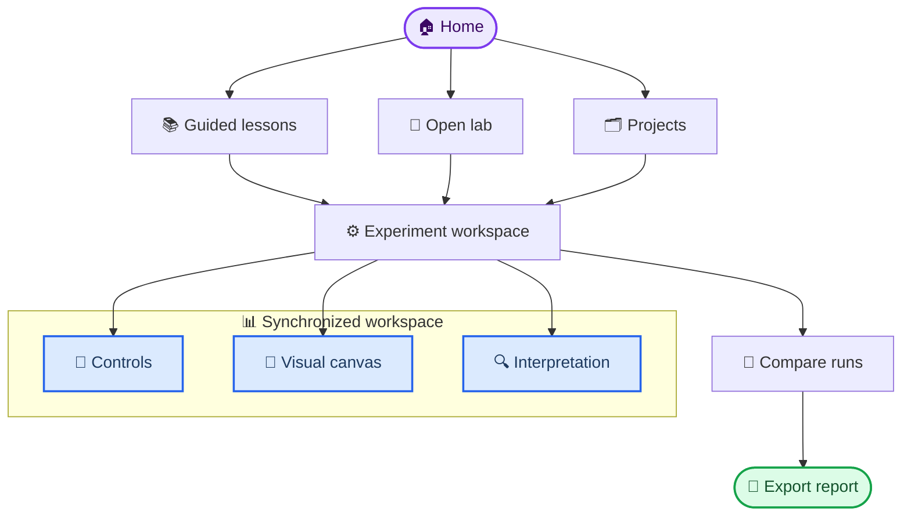

# NeuroBridge EEG Lab product requirements

_Draft v0.2 · 2026-08-31 · Local-first educational EEG simulation and functional-connectivity workbench_

---

## 📋 Executive summary

NeuroBridge EEG Lab is an interactive education and research-prototyping application for learning how scalp EEG is generated, transformed, cleaned, and analyzed. A learner should be able to build a signal from known latent sources, project or mix it into sensor data, introduce controlled artifacts, operate an MNE-Python analysis pipeline, estimate functional connectivity, and compare the estimate with the known simulation truth.

The product is not a diagnostic device and will not present real-data results as ground truth. Its differentiator is a **truth-first learning loop**: every lesson begins with a controlled system, asks the learner to predict what an analysis will recover, reveals the truth only at the appropriate moment, and explains why an estimate succeeds or fails.

Development is web-first: a local Python service and browser client remain the authoritative product until the scientific core and interaction model are stable. The same production web build can later be packaged with Electrobun or Tauri v2; desktop framework choice must not reshape the analysis core or lesson UI.

### Product decision

| Question | Decision |
| --- | --- |
| Development form | Local web app |
| Later distribution | Electrobun or Tauri v2 desktop wrapper |
| Packaging decision | Deferred until a tested web MVP and two bounded wrapper spikes |
| Architecture constraint | Wrapper-neutral client and versioned local API |
| Scientific engine | MNE-Python 1.12.x |
| Connectivity engine | MNE-Connectivity 0.8.x |
| Primary data | Deterministic simulation |
| Reference real data | PhysioNet EEGBCI |
| Primary audience | EEG beginner |
| Clinical use | Explicitly excluded |

## 🎯 Problem, vision, and success

### Problem

EEG tutorials often demonstrate how to call a function but do not let a beginner see the causal chain between assumptions and results. With real EEG alone, the learner cannot know whether an observed component, spectral peak, or network edge reflects brain activity, an artifact, volume conduction, referencing, filtering, limited data, or estimator bias.

The current repository supplies useful fragments but not this closed learning loop:

- [`week0.ipynb`](../week0.ipynb) through [`week8.ipynb`](../week8.ipynb) cover the foundations from units to spectral parameterization
- [`neurobridge_eeg_pipeline_v2_1.py`](neurobridge_eeg_pipeline_v2_1.py) demonstrates an MNE `Raw → Epochs → Evoked → features` workflow on EEGBCI data
- [`neurobridge_eeg_framework.py`](neurobridge_eeg_framework.py) demonstrates simple single-channel signal generation and classification
- No current component represents a known source network, forward projection, connectivity truth, or recovery score

### Vision

The application should feel like an interactive scientific bench:

1. Construct a known neural and artifact-generating system
2. Observe what scalp sensors can and cannot see
3. Change one analysis decision at a time
4. Compare estimates across methods and spaces
5. Reveal and score against truth
6. Explain the discrepancy in plain language
7. Save a reproducible experiment record

```mermaid
flowchart LR
    accTitle: Truth-First EEG Learning Loop
    accDescr: The learner predicts an outcome, generates known source activity, observes mixed scalp EEG, analyzes it, compares the estimate with truth, and revises one assumption at a time

    predict([🎯 Predict outcome]) --> define_truth[📋 Define source truth]
    define_truth --> simulate[🧠 Simulate activity]
    simulate --> observe[📊 Observe scalp EEG]
    observe --> analyze[🔧 Analyze signal]
    analyze --> estimate[🔗 Estimate network]
    estimate --> reveal[🔍 Reveal truth]
    reveal --> explain[📚 Explain mismatch]
    explain --> revise([✏️ Revise one choice])
    revise --> predict

    classDef start fill:#ede9fe,stroke:#7c3aed,stroke-width:2px,color:#3b0764
    classDef process fill:#dbeafe,stroke:#2563eb,stroke-width:2px,color:#1e3a5f
    classDef result fill:#dcfce7,stroke:#16a34a,stroke-width:2px,color:#14532d

    class predict,revise start
    class define_truth,simulate,observe,analyze,estimate process
    class reveal,explain result
```

### Product success metrics

| Outcome | MVP target |
| --- | ---: |
| First guided experiment completed | ≥ 80% of testers |
| Median time to first truth comparison | ≤ 10 minutes |
| Learner can explain reference dependence | ≥ 75% post-lab |
| Learner can identify a planted ICA artifact | ≥ 75% post-lab |
| Learner can distinguish connectivity from causality | ≥ 80% post-lab |
| Deterministic rerun equality | 100% for pinned recipes |
| Core scientific oracle tests | 100% passing |
| Unrecoverable analysis runs | < 1% |

These targets are product acceptance goals, not evidence of educational efficacy. A later study must define validated learning assessments and comparison conditions.

## 👤 Users and jobs to be done

### Primary learner

An EEG beginner with scientific or clinical interest who needs to build correct intuitions before writing independent analysis code.

Primary jobs:

- Understand what an EEG number represents, including units and reference
- See how sampling, filters, epoch duration, and noise alter observations
- Separate mixed neural and artifact sources with ICA
- Learn what spectral and connectivity estimators measure
- Understand why sensor-space connectivity can be misleading
- Reproduce an experiment and explain every processing decision

### Secondary instructor

An instructor or mentor who wants to launch a prepared lesson, lock some parameters, inspect a learner's experiment record, and discuss the resulting failure modes.

### Secondary analyst

A researcher who wants a controlled sandbox for sanity-checking a preprocessing or connectivity idea before applying it to real recordings.

### Primary user action

The single most important action is: **change one scientifically meaningful parameter and explain why the estimated result moved toward or away from truth**.

## 📚 Educational scope

### Existing notebook curriculum to preserve

All current notebooks executed without stored error outputs in the repository environment. Their concepts should become guided labs rather than being copied directly into UI code.

| Lab | Existing source | Product capability | Known truth or check |
| --- | --- | --- | --- |
| Environment and data | [`week0.ipynb`](../week0.ipynb) | Dataset loader, version inspector | Expected shapes and units |
| Voltage and reference | [`week1.ipynb`](../week1.ipynb) | Reference switcher | Common component change |
| Sampling and aliasing | [`week2.ipynb`](../week2.ipynb) | Sampling-rate control | Analytic alias frequency |
| Files and montage | [`week3.ipynb`](../week3.ipynb) | Metadata and sensor inspector | Known sensor positions |
| Filters and tradeoffs | [`week4.ipynb`](../week4.ipynb) | Filter response explorer | Planted 2/10/60 Hz peaks |
| Artifacts and ICA | [`week5.ipynb`](../week5.ipynb) | ICA component workbench | Planted artifact sources |
| Raw, Epochs, Evoked | [`week6.ipynb`](../week6.ipynb) | Epoch constructor and rejector | Expected epoch count |
| FFT, Welch, multitaper | [`week7.ipynb`](../week7.ipynb) | Spectrum explorer | Planted 10/10.4 Hz peaks |
| Periodic and aperiodic | [`week8.ipynb`](../week8.ipynb) | specparam explorer | Known exponent and peak |

### New connectivity curriculum

| Lab | Concept | Required interaction | Truth criterion |
| --- | --- | --- | --- |
| Signal kitchen | Linear mixtures | Mix 3–6 sources into sensors | Known mixing matrix |
| ICA recovery | Blind source separation | Remove selected components | Source correlation after assignment |
| Forward model | Source-to-scalp projection | Move source and montage | Known source location and lead field |
| Volume conduction | False zero-lag edges | Compare sensor metrics | Known uncoupled sources |
| Spectral connectivity | Coherence and phase metrics | Change lag and SNR | Known band and edge |
| Reference sensitivity | Reference-dependent networks | Switch reference/CSD | Same latent graph |
| Source connectivity | Inverse and ROI time courses | Compare sensor/source space | Known ROI graph |
| Statistical evidence | Surrogates and thresholds | Vary epochs and null count | Known null/alternative |
| Capstone | Hidden-truth challenge | Build and defend a pipeline | Pre-registered score rubric |

### Progressive learning ladder

Advanced analysis must extend the same experiment model rather than creating a separate expert product. Guidance decreases as competency grows, while units, provenance, warnings, and reproducibility remain mandatory.

| Level | Learner experience | Analysis scope | Release target |
| --- | --- | --- | --- |
| Foundations | Guided steps, constrained controls, immediate explanation | Units, reference, sampling, filtering, epochs, PSD | MVP |
| Core analysis | Guided experiments plus open parameter panels | ICA, artifacts, specparam, sensor connectivity | MVP |
| Advanced analysis | Open lab with method prerequisites and diagnostic checks | Time-frequency, statistics, source modeling, connectivity inference | Post-MVP |
| Research sandbox | Composable recipes and comparison notebooks/exports | Decoding, cross-frequency, graph, and directed-method adapters | Later |

Unlocking an advanced module does not imply that its output is more valid. Each module must state its assumptions, minimum data requirements, common failure modes, and whether simulation truth can test it.

## 🔍 Product principles

1. **Truth before realism:** start with a simple system whose answer is known, then add realism in layers.
2. **One-variable experiments:** controls encourage changing one factor while preserving a comparable baseline.
3. **Compare, do not merely display:** every transform offers before/after, method A/B, or estimate/truth views.
4. **Assumptions stay visible:** units, reference, rank, sampling rate, epoch duration, band, analysis space, and seed remain on screen.
5. **Warnings teach:** an invalid or redundant setting explains the scientific reason instead of only disabling a button.
6. **Real EEG has no revealed truth:** real-data mode shows evidence and uncertainty, never a truth score.
7. **Reproducibility is a feature:** every output links to a versioned recipe and environment record.
8. **Complexity grows by modules:** new analyses register against stable data and result contracts instead of adding special-case pipelines.

## 🧪 Core user journeys

### Guided lesson

1. Choose a lesson and read its learning objective
2. Inspect a small known signal or network
3. Record a prediction
4. Run the default recipe
5. Change one unlocked parameter
6. Compare synchronized views
7. Reveal truth and inspect recovery metrics
8. Answer a short explanation prompt
9. Save the completed experiment

### ICA artifact lab

1. Create independent neural sources plus blink, ECG, line-noise, and muscle sources
2. Mix them through a visible mixing matrix or an EEG forward model
3. Inspect sensor traces and spectra
4. Fit ICA on a high-pass, rank-aware copy
5. Inspect component trace, spectrum, topography, and ICLabel suggestion
6. Exclude components manually or accept selected suggestions
7. Apply the decomposition to a scientifically compatible target copy
8. Compare artifact attenuation with neural-signal distortion
9. Reveal source identity and compute recovery scores

### Functional-connectivity truth challenge

1. Select or generate a source graph
2. Choose oscillation frequencies, phase lags, coupling strengths, noise, and artifact levels
3. Project the sources to scalp EEG
4. Select reference, preprocessing, epoching, metric, frequency band, and threshold
5. Compare sensor-space and source-space estimates
6. Reveal the latent graph
7. Review missed edges, false edges, and the effect of volume conduction

### Real-data exploration

1. Load cached EEGBCI or import a supported local recording
2. Resolve channel types, units, montage, and annotations
3. Build a reversible preprocessing recipe
4. Inspect QC at every stage
5. Calculate spectra or connectivity with explicit uncertainty
6. Export an analysis record without a truth score

## ⚙️ Functional requirements

### Workspace and provenance

| ID | Priority | Requirement |
| --- | --- | --- |
| `FR-001` | P0 | Create, duplicate, rename, and archive local experiment projects |
| `FR-002` | P0 | Record immutable raw input plus a versioned analysis recipe |
| `FR-003` | P0 | Display seed, units, sampling rate, reference, rank, and software versions |
| `FR-004` | P0 | Undo/redo parameter changes without mutating the source data |
| `FR-005` | P0 | Compare any run with its immediate parent or a pinned baseline |
| `FR-006` | P1 | Export recipe JSON, figures, metrics CSV, and an `mne.Report`-based HTML report |

### Simulation studio

The simulation system has three levels. A beginner may start at Level A without anatomy and progressively unlock realistic projection.

| Level | Priority | Model | Educational purpose |
| --- | --- | --- | --- |
| A | P0 | Explicit linear mixture | Sampling, filtering, ICA |
| B | P0 | Parametric scalp mixture | Reference and volume conduction |
| C | P1 | MNE source and forward model | Source localization and ROI networks |

Required controls:

- Global seed, duration, sampling rate, montage, channel count, and output units
- Neural source waveform, frequency, amplitude, phase, burst timing, and aperiodic background
- Network edges with strength, phase lag, frequency band, and optional direction
- Sensor and source noise with user-visible SNR
- Blink, horizontal eye movement, ECG, muscle, line noise, drift, electrode pop, and bad-channel artifacts
- Mixing matrix for Level A and source location/ROI for Level C
- Presets for clean, noisy, volume-conducted, and null-network scenarios
- Hidden-truth mode for quizzes and visible-truth mode for exploration

MNE-Python provides `RawArray` for array-backed data and the simulation module for source estimates, raw sensor projection, Gaussian noise, EOG, and ECG artifacts.[^1]

### Preprocessing workbench

| ID | Priority | Requirement |
| --- | --- | --- |
| `FR-200` | P0 | Inspect raw traces, channel types, montage, annotations, and units |
| `FR-201` | P0 | Apply average, linked-mastoid when available, custom, and no-reference comparisons |
| `FR-202` | P0 | Configure high-pass, low-pass, band-pass, notch, and resampling |
| `FR-203` | P0 | Plot actual filter response, transition bands, and expected attenuation |
| `FR-204` | P0 | Mark/interpolate bad channels and show rank consequences |
| `FR-205` | P0 | Annotate/drop bad spans and epochs with retained-data accounting |
| `FR-206` | P1 | Apply current source density as a comparison transform |
| `FR-207` | P1 | Generate an automated QC summary and decision log |

Required warnings include:

- Requested frequency at or above Nyquist
- Notch frequency already outside the low-pass passband
- Filter longer than or poorly matched to the available signal
- Filtering after epoching without adequate padding
- More than a configurable fraction of channels or epochs rejected
- Connectivity comparison performed across inconsistent references, montages, or epoch lengths

### ICA workbench

| ID | Priority | Requirement |
| --- | --- | --- |
| `FR-300` | P0 | Create a dedicated ICA-fit copy with visible high-pass and reference |
| `FR-301` | P0 | Compute and display data rank before choosing component count |
| `FR-302` | P0 | Fit FastICA and extended Infomax with deterministic seeds |
| `FR-303` | P0 | Show component time course, PSD, topography, and explained variance |
| `FR-304` | P0 | Suggest component labels using `mne-icalabel` without auto-deleting |
| `FR-305` | P0 | Require explicit user selection before component removal |
| `FR-306` | P0 | Verify channel order, bad channels, projections, and reference compatibility before apply |
| `FR-307` | P0 | Score artifact attenuation and neural distortion against simulation truth |
| `FR-308` | P1 | Compare ICA algorithms and component-count choices |

MNE recommends inspecting artifacts before choosing a repair strategy, fitting ICA on high-pass-filtered data, and accounting for rank loss caused by average reference or interpolation.[^2]

### Epoch and spectral analysis

The app must support event-locked and fixed-length epochs, baseline correction only when appropriate, amplitude rejection, overlap controls, and a visible relationship between epoch/window duration and frequency resolution.

Spectral capabilities:

- FFT educational decomposition
- Welch PSD with window and overlap control
- Multitaper PSD with bandwidth control
- Absolute, relative, and log power
- Channel, region, epoch, and condition summaries
- Periodic/aperiodic separation with specparam
- Fit range, fit quality, peak count, offset, exponent, and peak parameters
- Side-by-side traditional band-power and periodic-peak comparisons

specparam input must remain on a linear power scale and the UI must show fit quality and failures rather than silently returning parameters.[^3]

### Functional connectivity

The MVP supports undirected functional connectivity. Directed or causal interpretations remain advanced and are not presented as equivalent to functional connectivity.

| Family | P0 methods | Later methods |
| --- | --- | --- |
| Time domain | Pearson correlation | Amplitude-envelope correlation |
| Spectral magnitude | Coherence | Multivariate coherency |
| Phase | PLV, PPC | ciPLV |
| Lag-sensitive | Imaginary coherence, PLI, wPLI | MIC, MIM |
| Directional | None | PSI, VAR, Granger |

`spectral_connectivity_epochs` accepts MNE `Epochs` or NumPy arrays and returns connectivity containers; the app must preserve method, frequency, node, epoch-combination, and dense/sparse representation metadata.[^4]

Required controls and outputs:

- Sensor-space or source/ROI-space analysis
- Node selection, seed-target selection, and all-to-all mode
- Frequency band, spectral mode, time window, and epoch selection
- Raw matrix, thresholded matrix, and strongest-edge views
- Null-surrogate or permutation distribution
- Confidence or variability across epochs where supported
- Explicit label for functional, lag-sensitive, or directed measure
- A visible warning that a network edge is an estimator output, not a synapse or proof of causality

### Truth and evaluation

Simulation runs retain an immutable `TruthBundle` that is hidden or revealed by the lesson state.

| Task | Required score |
| --- | --- |
| Frequency recovery | Peak-frequency error |
| ICA source recovery | Absolute source correlation after optimal assignment |
| Artifact removal | Artifact attenuation and neural distortion |
| Binary network recovery | ROC-AUC and average precision |
| Weighted network recovery | Upper-triangle correlation and normalized error |
| Strongest-edge teaching task | Precision@k and recall@k |
| Source localization | Peak or region localization error |

Scores must be accompanied by the assumptions that make them meaningful. A high score in one metric must not be collapsed into a universal “correctness” badge.

### Visualization and interaction

The default workspace uses three coordinated regions:

- Left: lesson context, parameter controls, presets, and prediction
- Center: primary synchronized visualization canvas
- Right: interpretation, warnings, truth comparison, and provenance

The central canvas supports:

- Scrollable multichannel time series with linked time cursor
- Source and sensor traces shown separately
- Montage and scalp topography
- ICA component gallery plus detailed component inspector
- PSD and time-frequency view
- Connectivity heatmap
- Scalp-edge network
- Circular ROI network
- Source-space view in P1
- Difference and uncertainty overlays

Interaction requirements:

- Hover links the same channel, source, node, or frequency across views
- A/B compare keeps axes and color scales locked by default
- Parameter changes show pending impact before recomputation
- Long computations are cancellable
- Truth reveal is a deliberate action in challenge mode
- Every warning links to a plain-language explanation and relevant lesson
- Color is never the only carrier of edge sign, strength, status, or condition

### Lesson engine

Lessons must be data-driven rather than hard-coded React pages. Each lesson definition contains:

- Stable ID, title, learning objective, and prerequisites
- Initial recipe and locked/unlocked controls
- Prediction prompt
- Checkpoints and expected observations
- Truth reveal policy
- Reflection question and scoring rubric
- Links to source notebook and official documentation
- Version of the scientific engine against which it was validated

### Analysis extension model

The product must support first-party analysis modules without exposing arbitrary plugin execution in the MVP.

| ID | Priority | Requirement |
| --- | --- | --- |
| `FR-700` | P0 | Discover available analysis modules and their versions from the local service |
| `FR-701` | P0 | Declare accepted input artifact types, parameters, outputs, warnings, and visualization capabilities for each module |
| `FR-702` | P0 | Persist module ID, schema version, engine version, and migration status in every recipe |
| `FR-703` | P0 | Render common result types—traces, spectra, topographies, matrices, graphs, tables—through reusable viewers |
| `FR-704` | P1 | Add first-party advanced modules without changing project storage or core run lifecycle |
| `FR-705` | P1 | Show prerequisites and minimum-data checks before an advanced analysis can run |
| `FR-706` | P2 | Evaluate a signed external-extension model only after reproducibility, sandboxing, and compatibility policy exist |

Candidate advanced families include event-related statistics, time-frequency analysis, source estimation, connectivity statistics, graph summaries, decoding, cross-frequency coupling, and carefully qualified directed methods. Inclusion requires a validated lesson or benchmark; appearing in MNE or another library is not sufficient by itself.

## 🏗️ Information architecture

## 🎨 Design brief

### Design direction

The interface should feel like a precise laboratory instrument joined to an annotated textbook. The working tone is calm, exploratory, and scientifically honest. It should avoid both a playful toy aesthetic that trivializes uncertainty and a dense clinical dashboard that intimidates beginners.

### Layout strategy

The current scientific question and main visualization receive the largest area. Controls are grouped by causal stage rather than by library name. Advanced options remain collapsed until a learner asks for them or reaches the relevant lesson. Results and caveats appear beside the figure they qualify, not in a distant documentation screen.

### Key states

| State | What the learner sees |
| --- | --- |
| First run | One recommended lesson and a two-minute orientation |
| Empty project | Simulation, sample data, or local import choices |
| Configuring | Live parameter validation and predicted consequences |
| Computing | Stage name, progress, elapsed time, and cancel action |
| Complete | Result, assumptions, warnings, and next comparison |
| Invalid | Exact scientific conflict and a suggested correction |
| Partial | Usable outputs plus failed-stage explanation |
| Hidden truth | Prediction and analysis without answer leakage |
| Revealed truth | Matched estimates, errors, and explanation |
| Real data | No truth score; uncertainty and provenance instead |

### Accessibility

- Target WCAG 2.2 AA for application controls and text
- Full keyboard operation for lessons, controls, comparisons, and truth reveal
- Visible focus, reduced-motion support, and screen-reader summaries for figures
- Colorblind-safe palettes plus line style, symbol, or label redundancy
- Adjustable trace density, label size, and contrast
- Core desktop viewport target of 1280 px or wider; smaller screens provide review rather than full analysis

### Open design questions

- Confirm the provisional tone: calm, exploratory, scientifically honest
- Decide whether dark inspection mode belongs in MVP or P1
- Validate whether the primary learner is an individual self-learner or an instructor-led cohort
- Choose Korean-only MVP or Korean/English bilingual content architecture from the start

## 🛡️ Scientific, privacy, and safety requirements

### Scientific guardrails

- Separate sensor space, source space, and latent simulation truth visually and semantically
- Preserve channel names, coordinate frames, units, reference, rank, bads, projections, and history
- Never label source reconstruction or real-data connectivity as ground truth
- Distinguish functional, effective, and structural connectivity
- Show the number and duration of retained epochs
- Record all thresholding and multiple-comparison decisions
- Make randomness deterministic and user-visible
- Warn when preprocessing choices invalidate comparison between runs
- Keep automated ICA labels advisory; require human confirmation
- Mark every generated report “educational/research use, not clinical diagnosis”

### Privacy and security

- Default to offline local processing
- Do not upload EEG or project data without a later explicit cloud feature and separate consent
- Strip or warn about personal identifiers on import/export
- Treat EDF/BDF/BrainVision annotations and filenames as potentially identifying
- Validate file type, size, channel count, sample rate, and path handling before ingestion
- Keep source data immutable and write derived artifacts to a project workspace

## 📈 Non-functional requirements

| Area | MVP requirement |
| --- | --- |
| Determinism | Same recipe and versions produce equal numeric output within declared tolerance |
| Interactivity | Lightweight control updates visible within 150 ms |
| Simulation | Standard 64-channel, 60-second Level A run within 2 seconds on target Mac |
| Connectivity | 64-channel, 30-epoch, five-band job cancellable and normally under 10 seconds |
| Large traces | Downsampled display without altering analysis data |
| Recovery | Interrupted jobs leave source data and prior results intact |
| Observability | Structured logs with project/run/stage IDs |
| Compatibility | macOS first; browser engines used by current Safari and Chromium |
| Portability | Production web build runs without Electrobun- or Tauri-specific imports |
| Extensibility | A new first-party analysis module uses stable contracts and reusable result viewers |
| Testing | Scientific oracle, API, UI, and visual-regression gates |

Performance targets are provisional until the first vertical slice establishes representative benchmarks.

## 🚫 Non-goals

- Clinical diagnosis, treatment recommendation, or medical-device claims
- Automatic interpretation of a patient's connectivity as healthy or pathological
- Real-time BCI or LSL streaming in MVP
- Cloud collaboration, accounts, billing, or multi-tenancy in MVP
- Whole-brain high-resolution individualized source modeling in MVP
- Deep learning classification in MVP
- Arbitrary third-party Python or frontend plugins in MVP
- Directed causality claims from short educational datasets
- Replacing MNE-Python notebooks or exposing every MNE parameter at once

## ✅ MVP acceptance criteria

The MVP is complete only when all of the following work end to end:

1. A new learner completes sampling, filtering, ICA, spectral, and connectivity labs
2. A deterministic mixed-source simulation produces MNE `Raw` and `Epochs`
3. The learner removes a planted blink component and sees both attenuation and neural distortion scores
4. The learner compares coherence, imaginary coherence, PLV, and wPLI on the same planted network
5. Sensor-space false edges caused by mixing can be demonstrated and explained
6. Every run is reproducible from exported recipe JSON
7. A cached EEGBCI recording can pass through the same non-truth pipeline
8. Invalid settings produce educational warnings rather than silent results
9. Unit, integration, scientific-oracle, accessibility, and smoke tests pass
10. The exported report contains settings, versions, exclusions, retained data, results, caveats, and the non-clinical notice
11. The production web client contains no dependency on a future desktop wrapper and passes the same end-to-end flow in Safari and Chromium

## 🔗 References

[^1]: MNE Developers. “Simulation.” _MNE-Python 1.12.1 documentation_. https://mne.tools/stable/api/simulation.html

[^2]: MNE Developers. “Repairing artifacts with ICA.” _MNE-Python 1.12.1 documentation_. https://mne.tools/stable/auto_tutorials/preprocessing/40_artifact_correction_ica.html

[^3]: Voytek Lab. “specparam.SpectralModel.” _specparam 2.0.0rc7 documentation_. https://specparam-tools.github.io/generated/specparam.SpectralModel.html

[^4]: MNE Developers. “MNE-Connectivity API.” _MNE-Connectivity 0.8.1 documentation_. https://mne.tools/mne-connectivity/stable/api.html
