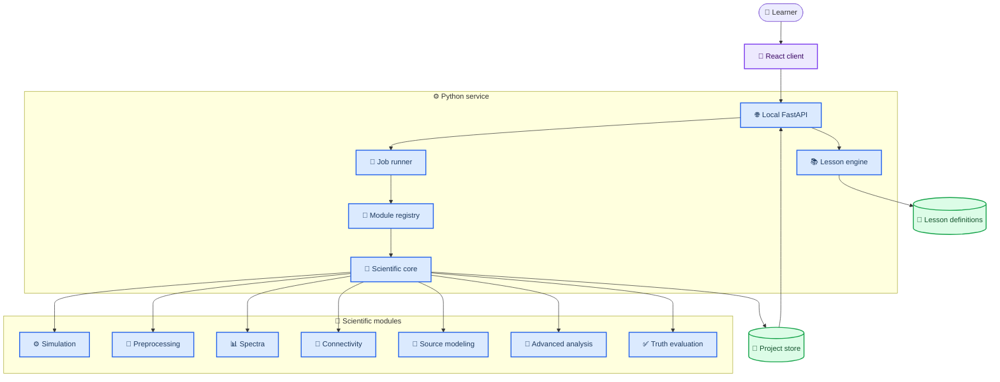
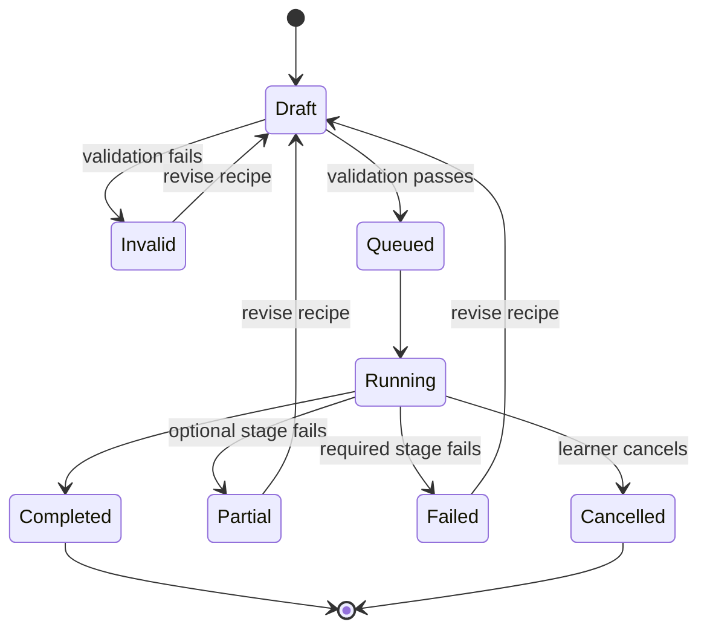

# NeuroSignal implementation plan

_Draft v0.2 · 2026-08-31 · Implementation contract for the product defined in [`PRD.md`](PRD.md)_

---

## 📋 Delivery strategy

Build NeuroSignal as a local-first web application with a separately testable scientific core. The first vertical slice must prove the entire truth loop on a small linear mixture before introducing anatomical forward models, source reconstruction, or desktop packaging.

The implementation order is intentional:

1. Turn notebook concepts into deterministic scientific functions and oracle tests
2. Establish versioned recipes and result contracts
3. Build one complete interactive lesson
4. Add ICA truth recovery
5. Add sensor connectivity and volume-conduction demonstrations
6. Add MNE source/forward simulation and source connectivity
7. Add real-data import and reporting
8. Grow advanced analysis through stable module contracts
9. Package the unchanged production web client only after Electrobun and Tauri spikes pass the same artifact test

```mermaid
flowchart LR
    accTitle: NeuroSignal Delivery Sequence
    accDescr: The project moves from verified scientific primitives to an interactive web learning slice, expands through ICA, connectivity, source modeling, and real data, then branches into advanced modules and desktop packaging

    contracts([📋 Define contracts]) --> core[🧪 Verify science core]
    core --> lesson[📚 Ship first lesson]
    lesson --> ica[🔧 Add ICA lab]
    ica --> connectivity[🔗 Add connectivity lab]
    connectivity --> source[🧠 Add source model]
    source --> real_data[📥 Add real data]
    real_data --> advanced[🔬 Add advanced modules]
    real_data --> desktop([📦 Package desktop])

    classDef start fill:#ede9fe,stroke:#7c3aed,stroke-width:2px,color:#3b0764
    classDef process fill:#dbeafe,stroke:#2563eb,stroke-width:2px,color:#1e3a5f
    classDef output fill:#dcfce7,stroke:#16a34a,stroke-width:2px,color:#14532d

    class contracts start
    class core,lesson,ica,connectivity,source,real_data,advanced process
    class desktop output
```



## 🏗️ Target architecture

### Architecture decision

Use a Python analysis service and a React/TypeScript client during MVP development.

| Layer | Choice | Reason |
| --- | --- | --- |
| Scientific core | Python package | Native MNE ecosystem |
| API | FastAPI | Typed local HTTP and generated schema |
| Jobs | Bounded process pool | Cancel long CPU-bound analyses |
| Client | React + TypeScript + Vite | Rich coordinated interactions |
| Charts | Plotly.js/WebGL plus custom scalp layer | Scientific plots and linked selection |
| Schemas | Pydantic + generated TypeScript types | One versioned contract |
| Project index | SQLite | Local metadata and search |
| Array artifacts | FIF + NPZ initially; Zarr when needed | Preserve MNE and large arrays |
| Reports | `mne.Report` plus app summary | Reproducible QC artifact |
| Desktop | Electrobun/Tauri v2 evaluation after web MVP | Wrapper is distribution infrastructure, not product architecture |

Do not embed scientific logic in API routes or React components. The Python core must run from tests and a CLI without the UI. React components must use a wrapper-neutral client adapter; no Electrobun or Tauri import is allowed in shared product UI code.



### Proposed repository layout

```text
Neurosignal-Testbed/
├── pyproject.toml
├── uv.lock
├── PRD.md
├── implementation_plan.md
├── apps/
│   ├── api/
│   │   └── neurobridge_api/
│   ├── web/
│   │   └── src/
│   └── desktop-spikes/           # created only at the packaging gate
│       ├── electrobun/
│       └── tauri/
├── packages/
│   └── neurobridge_core/
│       └── src/neurobridge/
│           ├── contracts/
│           ├── datasets/
│           ├── simulation/
│           ├── preprocessing/
│           ├── spectra/
│           ├── connectivity/
│           ├── source_modeling/
│           ├── module_registry/
│           ├── evaluation/
│           ├── reporting/
│           └── lessons/
├── lessons/
│   ├── foundations/
│   └── connectivity/
├── tests/
│   ├── unit/
│   ├── oracle/
│   ├── integration/
│   ├── e2e/
│   └── visual/
├── fixtures/
│   ├── recipes/
│   └── expected/
└── legacy/
    ├── neurobridge_eeg_framework.py
    └── neurobridge_eeg_pipeline_v2_1.py
```

The existing scripts remain unchanged until their useful behavior is covered by tests. They are then moved to `legacy/`; notebook files remain in the parent learning folder as source material.

## 📦 Version and environment policy

Start from the versions already demonstrated by the notebooks:

| Dependency | Baseline |
| --- | --- |
| Python | 3.14 in current study environment |
| MNE-Python | 1.12.1 |
| MNE-Connectivity | 0.8.1 |
| mne-icalabel | 0.9.0 |
| specparam | 2.0.0rc7 |
| NumPy | 2.5.2 |
| SciPy | 1.18.0 |
| scikit-learn | 1.8.0 |

Implementation requirements:

- Replace the incomplete `requirements.txt` with `pyproject.toml` and a committed `uv.lock`
- Separate `core`, `api`, `notebook`, and `dev` dependency groups
- Record exact versions in every experiment manifest
- Keep specparam behind an adapter because 2.0 is a release candidate with breaking changes
- Run the scientific matrix on the pinned baseline and the next supported Python version
- Re-evaluate Python/packager compatibility before desktop bundling; packaging may use a more mature Python runtime if required

## 🧾 Data and execution contracts

### Core principles

- Every scientific operation consumes an immutable input artifact and a validated specification
- Every output includes provenance and warnings
- Simulation truth is stored separately from learner-visible results
- API and UI never pass live MNE objects; they pass IDs, schemas, and serialized arrays
- Contract versions migrate explicitly

### Primary schemas

| Schema | Essential fields |
| --- | --- |
| `ProjectManifest` | ID, title, timestamps, locale, source artifact |
| `ExperimentRun` | parent run, recipe hash, state, versions, warnings |
| `SimulationSpec` | seed, duration, sampling, montage, sources, edges, artifacts |
| `SourceSpec` | kind, waveform, frequency, amplitude, phase, timing, location |
| `EdgeSpec` | source, target, strength, lag, band, direction |
| `ArtifactSpec` | blink/ECG/EMG/line/drift/pop, amplitude, timing |
| `PreprocessingSpec` | filters, resampling, reference, bads, ICA, epochs |
| `ConnectivitySpec` | space, method, nodes, band, mode, window, threshold |
| `TruthBundle` | latent signals, mixing/lead field, adjacency, source identity |
| `ResultManifest` | artifact IDs, shapes, units, metrics, figures, warnings |
| `LessonDefinition` | objective, recipe, controls, prompts, checks, reveal policy |
| `AnalysisModuleManifest` | module ID/version, input kinds, parameter schema, outputs, prerequisites |
| `CapabilityManifest` | installed modules, optional dependencies, datasets, renderer support |

### Artifact types

| Artifact | Format | Rule |
| --- | --- | --- |
| Imported/raw EEG | Original plus FIF working copy | Never mutate original |
| Simulated continuous EEG | FIF | Include annotations and montage |
| Epochs | FIF | Preserve drop log |
| ICA | `-ica.fif` | Include fit specification |
| Dense arrays | NPZ MVP | Include dimensions and units |
| Connectivity | NetCDF when supported or NPZ + manifest | Preserve node/frequency coordinates |
| Figures | SVG/PNG | Derivative only |
| Run record | JSON | Canonical reproducibility input |
| Report | HTML | Human-readable derivative |

### Pipeline state machine



### Extensibility contract

Advanced analysis is a first-party module system, not a collection of additional API routes. Each Python module implements the same lifecycle:

1. Declare a stable ID, semantic version, input artifact kinds, parameter schema, and required optional dependencies
2. Validate scientific prerequisites before scheduling work
3. Execute against immutable artifact IDs and a typed specification
4. Publish standard artifacts and a `ResultManifest`
5. Summarize assumptions, warnings, retained data, and appropriate visualizations
6. Provide deterministic fixtures or statistically bounded oracle tests

The registry exposes capability metadata to the UI. The client chooses reusable viewers from declared output kinds rather than importing module-specific Python knowledge. Recipes pin module and schema versions; incompatible changes require explicit migration.

Initial module families:

| Family | Core interface | Example progression |
| --- | --- | --- |
| Preprocessing | `Raw → Raw` | filters → bad channels → ICA → CSD |
| Epoch analysis | `Raw/Epochs → Epochs/Evoked` | fixed epochs → event-related averages → statistics |
| Spectrum | `Raw/Epochs → Spectrum` | Welch → multitaper → time-frequency → specparam |
| Connectivity | `Epochs/Source time courses → Connectivity` | coherence/phase → surrogates → multivariate/directed methods |
| Source | `Raw/Epochs + anatomy → Source estimate` | template forward → inverse → ROI extraction |
| Learning/decoding | `Epochs/features → Model result` | cross-validation → temporal decoding → generalization |

External code installation is out of scope until there is a signed package format, dependency isolation, permission model, and reproducibility policy.

## 🧪 Scientific core work packages

### Work package 0: notebook audit and oracle extraction

Create a compact test recipe for every notebook concept. Do not use notebook output as the sole oracle; use analytic or independently calculated expectations where possible.

| Notebook | Extracted primitive | Automated oracle |
| --- | --- | --- |
| Week 0 | Load and inspect EEGBCI | Shape, units, sampling metadata |
| Week 1 | Re-reference | Channel mean near zero after average reference |
| Week 2 | Aliasing and resampling | Recovered alias equals analytic value |
| Week 3 | Montage and FIF round-trip | Coordinates and metadata preserved |
| Week 4 | Filter response | Measured gain matches designed response |
| Week 5 | ICA and rank | Planted artifact recovered and safely removed |
| Week 6 | Epoching and rejection | Epoch count and drop log match recipe |
| Week 7 | PSD resolution | Peaks resolve only at sufficient window length |
| Week 8 | Spectral parameterization | Exponent changes without planted peak change |

Correct two notebook-derived traps in production behavior:

1. A 60 Hz notch after a 40 Hz low-pass is flagged as redundant rather than taught as an independent necessary step.
2. ICA fitted after average reference may only be applied to a target with compatible channels, bads, projections, and reference. The intentional high-pass difference is recorded separately.

Exit gate:

- Nine oracle recipes pass deterministically
- Each recipe has plain-language expected observations
- Notebook files are unchanged

### Work package 1: core data model and reversible preprocessing

Implement:

- `Raw`, `Epochs`, and `Evoked` adapters
- Unit-normalized import and export
- Montage resolution and channel-name diagnostics
- Filtering, notch, resampling, and response calculation
- Reference comparison
- Annotation, bad-channel, interpolation, and epoch rejection
- Stage provenance and warnings

Scientific invariants:

- Analysis arrays remain SI units internally
- Display conversion never mutates analysis data
- Original input is immutable
- Rank is recomputed after reference, projection, or interpolation changes
- Frequency settings are validated against Nyquist
- Epoch retention is reported by count and duration

Exit gate:

- Week 0–4 and Week 6–7 oracles pass through public core APIs
- Round-trip FIF metadata test passes
- Before/after transforms preserve provenance links

### Work package 2: Level A simulation and ICA truth lab

Implement a deterministic source-mixing engine:

```text
latent neural sources
+ blink / eye movement / ECG / EMG / line / drift sources
                        ↓
              visible mixing matrix
                        ↓
                 sensor channels
                        ↓
                    MNE Raw
```

Signal generators:

- Sine and phase-shifted sine
- Narrow-band oscillation with amplitude envelope
- Transient burst
- Event-related waveform
- 1/f-like stochastic background
- Blink and eye-movement waveform
- ECG-like repeating waveform
- Broadband muscle burst
- Line noise and drift
- White and colored noise

ICA evaluation:

1. Standardize true and estimated source time courses
2. Compute absolute correlation matrix
3. Use optimal one-to-one assignment
4. Report matched correlation and unmatched components
5. Quantify artifact attenuation in source and sensor space
6. Quantify distortion of retained neural sources

Exit gate:

- A three-neural-source plus one-blink recipe recovers the blink above the agreed threshold
- The app prevents incompatible ICA apply
- Manual exclusion and ICLabel suggestion remain separate states
- No-artifact control demonstrates the cost of unnecessary removal

### Work package 3: spectral analysis and specparam adapter

Implement:

- FFT teaching result with amplitude and phase
- Welch and multitaper PSD
- Band integration with half-open non-overlapping bands
- Absolute, relative, and log power
- Frequency/window resolution calculations
- specparam 2 adapter with fit diagnostics
- Periodic/aperiodic comparison view

Avoid duplicating the V2.1 behavior that labels mean PSD as integrated band power. Store estimator and units explicitly.

Exit gate:

- Known peaks and exponents recover within declared tolerances
- Poor fits and missing peaks yield explicit states
- Relative power reports its denominator and compositional caveat

### Work package 4: sensor-space connectivity

Implement a single internal connectivity result model across estimators.

Initial methods:

- Pearson correlation
- Coherence
- Imaginary coherence
- PLV
- PPC
- PLI
- wPLI and debiased squared wPLI

For every result preserve:

- Method and mathematical family
- Node names and order
- Frequency coordinates and averaging choice
- Epoch-combination behavior
- Time interval and number of samples/epochs
- Reference, rank, preprocessing recipe, and analysis space

Truth scenarios:

| Scenario | Expected observation |
| --- | --- |
| Independent sources, no mixing | Near-null network |
| One phase-lagged pair | Correct band and edge |
| Independent sources, shared mixing | False sensor-space zero-lag edges |
| Coupled pair plus low SNR | Recovery degrades with noise |
| More epochs | Estimate stability improves |
| Reference switch | Sensor network changes despite same truth |

Exit gate:

- Dense matrix values agree with direct MNE-Connectivity calls
- Null and coupled fixtures meet false-positive/recovery bounds
- Thresholding affects visualization only unless explicitly saved as a derived graph

### Work package 5: anatomy-aware simulation and source connectivity

Use MNE `SourceSimulator` or explicit `SourceEstimate` time courses, a template source space, EEG forward solution, and controlled noise to project known ROI activity to scalp sensors.[^1]

Implementation stages:

1. Cache an approved template dataset and license metadata
2. Define 2–6 ROI source recipes
3. Generate coupled source time courses outside the MNE wrapper
4. Add the time courses to labels/source vertices
5. Forward-project to the selected EEG montage
6. Add sensor noise and supported artifacts
7. Reconstruct source estimates with a documented inverse method
8. Extract ROI time courses
9. Estimate source connectivity
10. Compare latent, sensor, and reconstructed-source graphs

Guardrails:

- Label template anatomy as illustrative, not individualized
- Keep latent source truth distinct from reconstructed sources
- Show point-spread/leakage caveats
- Require adequate digitization/forward metadata for user real-data source analysis
- Do not include individualized source reconstruction in MVP acceptance

Exit gate:

- Known ROI locations project to plausible scalp topographies
- Source reconstruction error is quantified
- Latent, sensor, and source estimates can be compared with locked scales

### Work package 6: real-data pipeline

MVP supported formats:

- FIF
- EDF/EDF+
- BDF
- BrainVision header sets
- EEGLAB `.set`

Implement import as a guided resolver:

1. Read without mutation
2. Inspect units, channel types, names, sampling, filters, annotations, and dig points
3. Ask for or infer montage only with visible evidence
4. Save a FIF working copy
5. Run basic QC
6. Allow the same preprocessing, spectral, and connectivity modules
7. Disable all truth scores

EEGBCI eyes-open/eyes-closed becomes the bundled validation lesson. The expected Berger effect is a pipeline check, not a guarantee for every individual recording.

Exit gate:

- Cached EEGBCI lesson runs offline after first acquisition
- Import errors identify the missing file or metadata precisely
- Real-data reports never display truth language

## 🎨 Client implementation

### Workspace shell

Build the client around one stable experiment screen rather than separate pages for every method.

| Region | Contents |
| --- | --- |
| Left rail | Lesson steps, pipeline stages, presets |
| Left panel | Controls for selected stage |
| Center canvas | Traces, spectra, scalp maps, ICA, network |
| Right panel | Explanation, warnings, truth, provenance |
| Bottom strip | Runs, comparisons, progress, logs |

### Shared interaction state

The following selections synchronize across figures:

- Time cursor and time window
- Channel/source/node
- Epoch
- Frequency and band
- Condition/run
- Sensor versus source space
- Truth visibility

Do not store large scientific arrays in general React state. Keep normalized view state in the client and fetch binary/downsampled data by artifact ID and viewport.

### Visualization components

| Component | MVP behavior |
| --- | --- |
| `TraceViewer` | Virtualized channels, linked cursor, annotations |
| `SpectrumViewer` | PSD, band shading, method comparison |
| `FilterResponseViewer` | Pass/stop/transition bands and gain |
| `MontageViewer` | Sensors, bads, selected nodes |
| `TopomapViewer` | Locked-scale before/after maps |
| `ICAViewer` | Component overview and detailed inspector |
| `ConnectivityMatrix` | Hover-linked dense matrix |
| `ScalpNetwork` | Sensor positions and thresholded edges |
| `ConnectivityCircle` | ROI/sensor circular layout |
| `TruthComparator` | Estimate/truth/difference plus metrics |
| `ProvenanceInspector` | Recipe, versions, warnings, artifacts |

### Lesson authoring format

Start with YAML lesson definitions validated into `LessonDefinition`. Keep executable recipes in JSON fixtures and prose in Markdown fragments. Lesson content may reference UI control IDs but must not contain arbitrary executable Python.

Exit gate:

- A content author can add a lesson without changing React routing
- Missing controls or incompatible lesson versions fail validation during CI

## 🌐 Local API plan

### Endpoint groups

| Endpoint | Purpose |
| --- | --- |
| `GET /health` | Version and dependency readiness |
| `GET /capabilities` | Installed modules, datasets, optional dependencies, and client compatibility |
| `GET /analysis-modules` | Versioned module manifests and parameter schemas |
| `GET /lessons` | Validated lesson catalog |
| `POST /projects` | Create local project |
| `POST /runs/validate` | Validate recipe and return warnings |
| `POST /runs` | Queue experiment run |
| `GET /runs/{id}` | Status and result manifest |
| `DELETE /runs/{id}` | Cancel running job |
| `GET /artifacts/{id}` | Metadata or binary artifact |
| `GET /artifacts/{id}/view` | Downsampled viewport data |
| `POST /comparisons` | Create derived A/B comparison |
| `POST /reports` | Generate report |

Use server-sent events or a small WebSocket channel for progress. Result artifacts remain fetchable through ordinary HTTP so reconnecting does not lose completed work.

### Job execution

- Run CPU-bound MNE jobs outside the API event loop
- Bound worker count by CPU and memory
- Pass artifact IDs and serialized specs to workers, not live request objects
- Write results to a temporary run directory
- Validate result manifest before atomic publication
- Preserve partial diagnostic output when an optional stage fails
- Cancel between defined stages and clean temporary files safely

## ✅ Testing and validation

### Test pyramid

| Layer | Coverage |
| --- | --- |
| Unit | Generators, validators, transforms, metrics |
| Scientific oracle | Known signal and network recovery |
| Property | Shapes, units, determinism, bounds, symmetry |
| Integration | MNE objects, storage, API jobs |
| Contract | Python schemas and TypeScript clients |
| End to end | Guided labs and export |
| Visual | Locked-scale plots, color, labels, empty/error states |
| Accessibility | Keyboard, focus, names, contrast, reduced motion |

### Required scientific oracle suite

| Oracle | Pass condition |
| --- | --- |
| Average reference | Across-channel mean is near zero |
| Aliasing | Observed frequency equals analytic alias |
| Resampling | Above-new-Nyquist tone is sufficiently attenuated |
| Filter | Measured gains fall within design tolerance |
| Epoching | Count, sample length, and drop log match spec |
| PSD | Planted peaks and resolution behavior match theory |
| specparam | Planted exponent/peak recovered within tolerance |
| ICA | Artifact matched and removal/distortion quantified |
| Null connectivity | False-edge rate below declared bound |
| Coupled connectivity | Planted edge and band recover above threshold |
| Mixing bias | Expected false zero-lag sensor edges demonstrated |
| Source projection | Known source projects and reconstructs within benchmark |

Tolerance values must be fixture-specific and statistically justified. Do not set one universal numeric threshold for every recipe.

### Regression policy

- Pin seeds and recipes, not opaque output screenshots alone
- Compare arrays with declared tolerances and metadata equality
- Mark stochastic tests with repeated-run bounds
- Keep a small offline fixture suite for CI
- Run dataset-download and heavy source-model tests separately
- Store benchmark provenance with MNE and dependency versions

## 🚀 Phased delivery plan

### Phase 0: foundation

Deliverables:

- Package skeleton, lockfile, lint/type/test configuration
- Versioned Pydantic schemas
- Analysis module protocol, registry, and capability manifest
- Project store prototype
- Notebook oracle inventory
- CI with offline fixtures

Gate: a recipe can be validated, hashed, executed by CLI, and stored with provenance.

### Phase 1: first vertical slice

Lesson: sampling and filtering a known multi-frequency signal.

Deliverables:

- React workspace shell
- Local API and job progress
- Level A signal generator
- Raw trace, PSD, and filter response views
- Prediction, truth reveal, and comparison
- Recipe export/import

Gate: a new user completes the lesson without notebook or terminal access.

### Phase 2: preprocessing and ICA lab

Deliverables:

- Reference and rank explorer
- Artifact generators
- ICA fit/inspect/exclude/apply workflow
- ICLabel advisory integration
- Recovery and distortion scoring

Gate: planted blink recovery and no-artifact control pass end to end.

### Phase 3: spectrum and connectivity MVP

Deliverables:

- Welch/multitaper and specparam labs
- Connectivity estimators
- Matrix, scalp network, and circle views
- Null surrogates and truth metrics
- Volume-conduction and reference lessons

Gate: the complete connectivity truth challenge satisfies the PRD MVP criteria.

### Phase 4: MNE source modeling

Deliverables:

- Template ROI simulation
- Forward projection
- Basic inverse reconstruction
- ROI time-course extraction
- Latent/sensor/source comparison

Gate: source benchmark and leakage caveat workflow pass.

### Phase 5: real data and reporting

Deliverables:

- Guided import resolver
- EEGBCI offline lesson
- QC report and HTML export
- Project recovery and compatibility migrations

Gate: import-to-report workflow runs without truth language or source mutation.

### Advanced analysis track: Phase 4 onward

This track can proceed independently of desktop packaging once the relevant scientific artifact contracts are stable.

| Tier | Candidate modules | Admission gate |
| --- | --- | --- |
| A | Time-frequency representations, evoked statistics, CSD, template source estimation | Analytic or simulation oracle plus beginner-facing prerequisite checks |
| B | Connectivity surrogates, multiple-comparison control, graph summaries, multivariate connectivity | Null and planted-network benchmarks plus uncertainty display |
| C | Decoding, temporal generalization, cross-frequency coupling, microstate adapter | Leakage-safe validation and method-specific lesson |
| D | PSI or other directed estimators | Strong causality caveats, adequate-data checks, and no causal truth claim on real EEG |

Do not schedule a module because it is “advanced.” Add it when it answers a clear educational question and can be tested against known structure.

### Phase 6: desktop distribution

Deliverables:

- Freeze a wrapper-neutral desktop integration contract: launch, authenticated loopback health check, project paths, progress, shutdown, logs, and support bundle
- Build bounded Electrobun and Tauri v2 spikes from the same production web assets and Python worker artifact
- In Electrobun, keep native actions behind a typed main/view boundary and prove resource lookup plus worker cleanup before quit[^2]
- In Tauri v2, bundle the worker as a sidecar and grant only explicit capability-scoped execution permissions[^3]
- Select one wrapper using measured startup, memory, artifact size, signing/updating, Python-worker reliability, cross-platform CI, and maintenance cost
- Signed macOS application
- Bundled or managed Python runtime decision
- First-run dataset cache and license notices
- Crash recovery and support bundle

The wrapper selection is a gate, not an early preference. Electrobun favors a TypeScript/Bun main process; Tauri adds a Rust/native capability boundary. Both must supervise the same Python service without duplicating scientific logic.

Gate: a clean Mac installs the selected artifact, launches offline, completes the first lesson, exports a report, terminates the Python worker cleanly, and relaunches the saved project. The browser build must continue to pass the same product E2E suite.

## 🛡️ Risks and mitigations

| Risk | Impact | Mitigation |
| --- | --- | --- |
| Sensor connectivity overinterpretation | Scientific harm | Truth labs, persistent space/reference labels |
| ICA removes neural signal | Mislearning | Manual confirmation and distortion score |
| Forward model download is large | Poor onboarding | Level A first; lazy cached Level C assets |
| Browser cannot render dense traces | Slow UI | Viewport downsampling and WebGL |
| Long jobs block UI | Unusable app | Process pool, progress, cancellation |
| Package version drift | Broken reproducibility | Lockfile, recipe versions, adapters |
| specparam release-candidate changes | API churn | Narrow adapter and contract tests |
| Desktop Python bundling | Release risk | Defer packaging until web MVP; spike early |
| Wrapper-specific UI code | Web/desktop divergence | Wrapper-neutral client adapter and shared E2E suite |
| Unbounded extension dependencies | Reproducibility and security loss | First-party registry, optional dependency groups, versioned manifests |
| Real EEG contains identifiers | Privacy risk | Local-only default and import warnings |
| Lesson prose diverges from code | Incorrect teaching | Executable fixtures and CI lesson validation |

## 🔍 Review gates and definition of done

Every work package is done only when:

- Public scientific APIs have type annotations and docstrings with units
- A deterministic fixture covers the normal path
- At least one invalid or adversarial case is covered
- Result metadata identifies method, parameters, space, units, and versions
- The UI exposes progress, cancellation, empty, partial, and error states
- Relevant accessibility checks pass
- User-facing caveats are reviewed alongside numeric output
- Documentation and lesson definitions are updated in the same change
- `git diff --check`, Python tests, type checks, frontend tests, and production builds pass

## ✍️ First implementation backlog

1. Create `pyproject.toml`, dependency groups, and lockfile
2. Add package/API/web skeletons and health check
3. Define `SimulationSpec`, `PreprocessingSpec`, `TruthBundle`, and `ResultManifest`
4. Implement deterministic sine, burst, noise, line, and blink generators
5. Implement linear mixing and `RawArray` conversion
6. Port Week 1, 2, and 4 concepts into oracle tests
7. Implement filter/reference operations and warning rules
8. Build trace, PSD, filter-response, and provenance views
9. Author the first sampling/filtering lesson
10. Complete recipe export/import and first vertical-slice E2E test
11. Implement rank-aware ICA pipeline and compatibility validation
12. Add ICA truth matching, attenuation, and distortion metrics
13. Add MNE-Connectivity adapter and planted-edge fixtures
14. Build matrix/scalp/circle linked views
15. Author volume-conduction and reference-sensitivity lessons
16. Add the analysis-module registry and one example module loaded only through its manifest
17. Add capability compatibility tests for an unavailable optional dependency

Do not begin high-resolution source modeling or desktop packaging before items 1–10 form a usable, tested vertical slice.

## 🔗 References

[^1]: MNE Developers. “Generate simulated source data.” _MNE-Python 1.12.1 documentation_. https://mne.tools/stable/auto_examples/simulation/source_simulator.html

[^2]: Blackboard. “Electrobun documentation.” https://blackboard.sh/electrobun/docs/

[^3]: Tauri contributors. “Embedding external binaries.” _Tauri v2 documentation_. https://v2.tauri.app/develop/sidecar/
